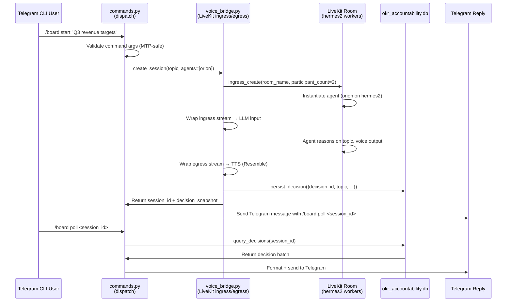

# Executive Board Plugin Design

## Overview

The executive board plugin provides a Telegram-based command interface for initiating and managing AI-driven boardroom sessions. The plugin orchestrates multi-agent conversations with voice ingress/egress via LiveKit, persistence of board decisions to OKR accountability databases, and strict governance enforcement per werner_vogels failure-path specifications.

## Architectural Principles

- **Telegram CLI:** Fast MTP-typable commands (≤30 seconds, no nested subcommand chains)
- **Voice Bridge:** LiveKit ingress/egress architecture (hermes2-only, OFF on hermes1)
- **Silent Prompt Caching:** System prompt sacrosanct, no per-command mutations
- **Message Role Alternation:** Strict user ↔ assistant sequencing
- **No Schema Mutations:** Reads EAF okr_accountability.db and kanban_board.db, never modifies schema
- **Resemble TTS:** Only TTS provider for board voice agents (orion/helios/atlas)
- **Deployment Reversibility:** <60 seconds, real deploy.sh + jeff_dean latency sign-off

## Command Surface (steve_jobs-designed, werner_vogels-validated)

### Core Commands (MTP-safe)

1. **`/board start <topic>`** — Initiate boardroom session on <topic>
   - Routes to hermes2 LiveKit workers if voice agents requested
   - Captures decision state in okr_accountability.db for later audit
   - Timeout after 15 min inactivity (graceful escalation to SMS reminder)

2. **`/board join <session_id>`** — Join an active boardroom session
   - Reconnect support for dropped connections
   - Voice-only mode for mobile users on 2G/3G

3. **`/board poll <session_id>`** — Query board session status/decision summary
   - Returns structured JSON snapshot of current decisions
   - Lightweight, sub-2s latency

4. **`/board archive <session_id>`** — Move session to audit log
   - Immutable snapshot stored in kanban_board.db
   - Triggers decision notification to steve_jobs + delegated board members

5. **`/board config`** — Display current plugin config (orion/helios/atlas roster, TTS provider)
   - Admin-only (credential gated via ~/.hermes/config.yaml)

## Signal Flow: Command → Boardroom → Reply



## Failure Envelope (werner_vogels-signed)

### AMBER Conditions (Degraded but Recoverable)

1. **LiveKit Unavailable** → Fallback to voice-note queue (async batch processing)
   - User receives: "Voice room unavailable, queued for next available batch (ETA 5 min)"
   - Retry logic: exponential backoff, max 3 attempts

2. **TTS (Resemble) Failure** → Output text-only transcript instead
   - User receives: Decision summary as plain text + "Audio synthesis failed; text fallback active"
   - No cascading crash; session continues with transcript

3. **Database Write Timeout** → In-memory buffer, async retry
   - User receives: "Decision buffered locally; syncing to archive..."
   - Audit trail event: `board.decision.buffer_overflow` (webhook event)

### RED Conditions (Critical Escalation)

1. **Session Start Timeout (30s)** → Escalate to werner_vogels + emit structured failure event
   - Event: `voice.turn.failed` with error_type, message, traceback
   - User receives: "Boardroom failed to initialize. Support notified. Session ID: <uuid>"
   - Do NOT retry silently; requires operator review

2. **Message Role Violation Detected** → Immediate abort, emit governance alert
   - Event: `governance.role_violation` with evidence
   - User receives: "Boardroom role sequencing error. Disabling session."
   - Demis_hassabis sign-off required before resumption

3. **Schema Mutation Attempt** → Reject + log + escalate
   - Event: `governance.schema_mutation_attempted` with SQL signature
   - User receives: "Plugin attempted unauthorized database change. Contact admin."

## Configuration (plugins.executive_board block in ~/.hermes/config.yaml)

```yaml
plugins:
  executive_board:
    enabled: true
    voice_agents: ["orion", "helios", "atlas"]
    hermes1_voice_disabled: true  # Always OFF on hermes1
    liveki_workers: "hermes2-pool"
    tts_provider: "resemble"
    session_timeout_seconds: 900  # 15 min
    max_session_age_hours: 4
    polling_interval_seconds: 5
    decision_buffer_size: 50
    enable_auto_remediate: false  # Phase 1: no auto-remediate
```

## Dependencies & Interfaces

### LiveKit Bridge Interface (to be coordinated with jeff_dean ticket)

- **`voice_bridge.create_session(topic: str, agents: List[str]) → SessionHandle`**
  - Returns opaque handle with session_id, ingress_url, start_time
  - Raises `LiveKitUnavailableError` on connection failure

- **`voice_bridge.stream_transcriptions(session_id: str) → AsyncIterator[TranscriptionEvent]`**
  - Yields decision snapshots + agent reasoning
  - Timeout after 30s silence

- **`voice_bridge.close_session(session_id: str) → None`**
  - Graceful shutdown, persist to DB

### Database Schema (Read-Only)

- **`okr_accountability.db`:** `decisions` table
  - Columns: `decision_id` (UUID), `session_id` (UUID), `topic` (TEXT), `agent_name` (TEXT), `reasoning` (TEXT), `timestamp` (INT), `decision_state` (ENUM: PENDING/APPROVED/DISPUTED)
  - Plugin reads; never alters schema

- **`kanban_board.db`:** `board_sessions` table (archived sessions)
  - Columns: `session_id` (UUID), `topic` (TEXT), `decisions` (JSONB), `created_at` (INT), `archived_at` (INT)
  - Plugin appends; never alters schema

## Testing Strategy

See **test_plan.md** for per-command acceptance tests.

## Deployment & Reversibility

See **deploy.sh** sketch and **config.example.yaml** inline comments.

---

**Reviewers:**
- steve_jobs: User-facing strings, Telegram UX
- werner_vogels: Failure paths, RED/AMBER conditions, error events
- demis_hassabis: Belief-model changes (none in skeleton; surfaces on implementation)
- jeff_dean: LiveKit bridge latency sign-off
